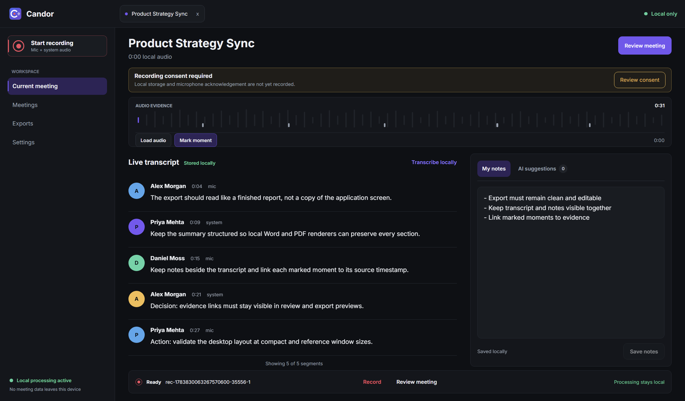
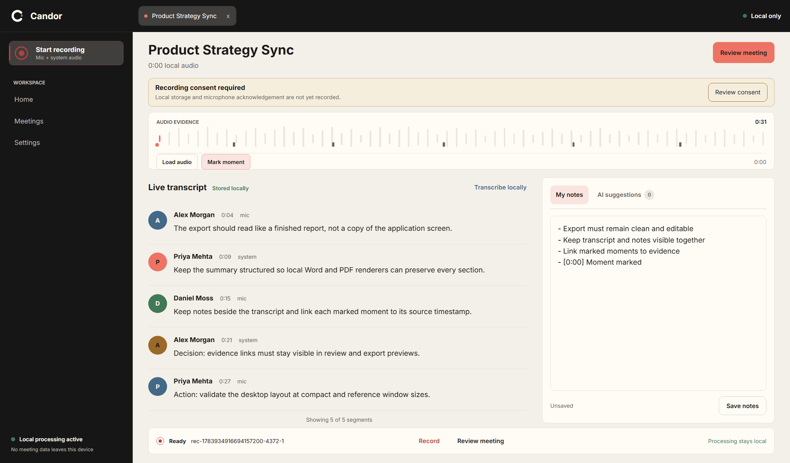

# V4 GUI Comparison

These captures use synthetic meeting content and the Windows Electron renderer
at the reference desktop size.

## Before

The pre-consolidation surface exposed a dense dark interface, violet actions,
and equal-weight workspace destinations.

## After

The V4 surface applies the Candor cream, coral, and charcoal system, simplifies
normal navigation to Home, Meetings, and Settings, and keeps Record, Review, and
Export visually dominant.

